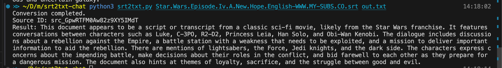
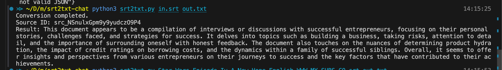

# Srt summary

Created this after reading this [tweet](https://twitter.com/championswimmer/status/1765437720917377521)

Get your API key from https://www.chatpdf.com/docs/api/backend 
for this to work.

Also you can  change the prompt inside the code according to your needs.

Run with 

``` python

python3 srt2txt.py input.srt output.txt 

```
Summary of star wars


Summary of latest WTF podcast
